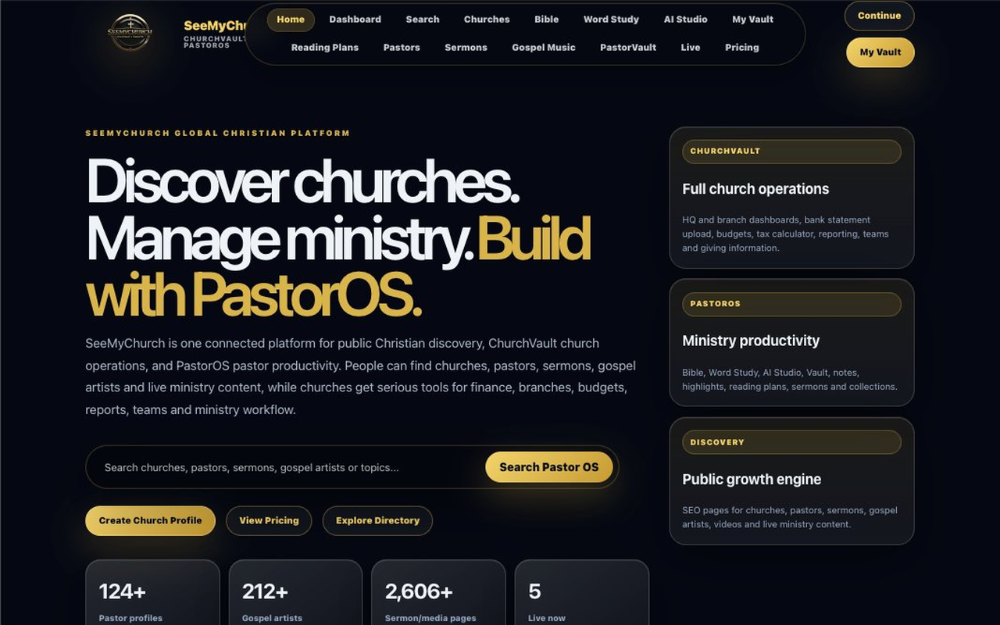
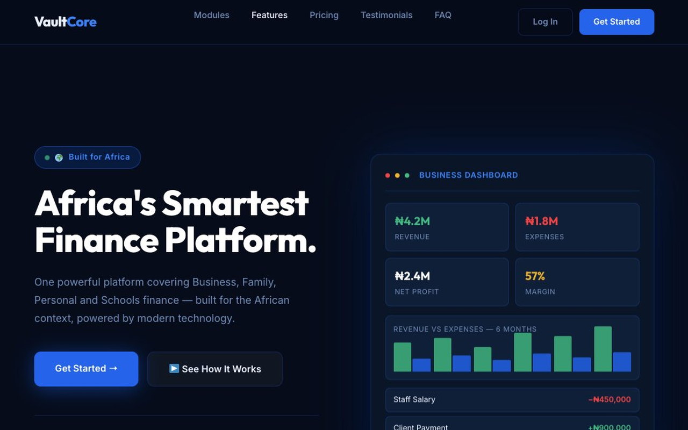
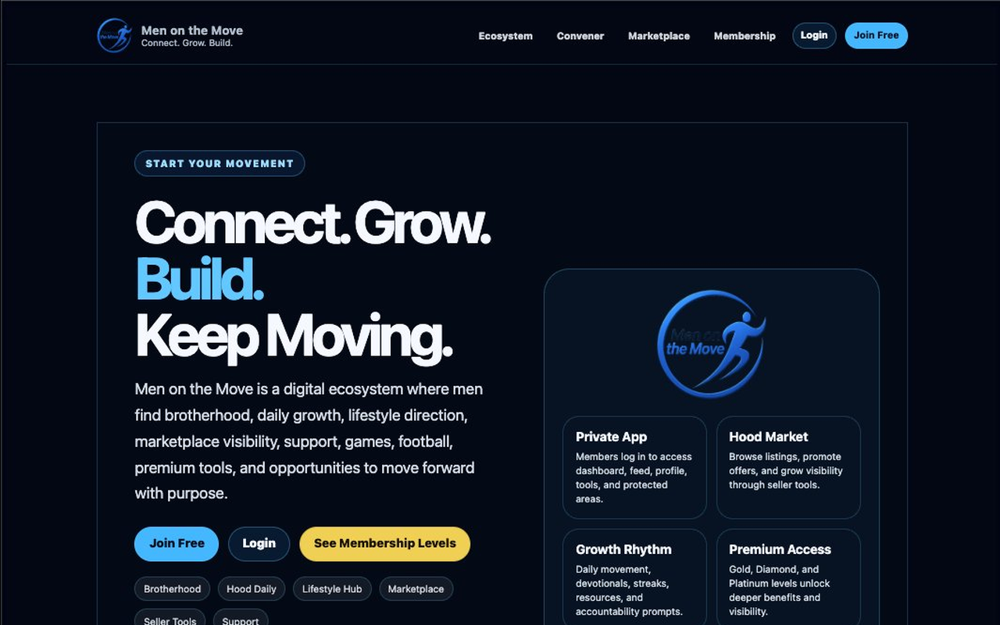

# Hi, I'm Dunamis Olatunde 👋
Product Engineer | SaaS Builder | Creator of Kisses & Huggs Club, PastorOS, VaultCore & Men on the Move

I build software around real-world organizational problems.

Over the last several years I've designed, built, deployed, and maintained production platforms serving ministries, communities, businesses, and membership organizations. My work spans relationship ecosystems, ministry operating systems, finance platforms, and community networks serving real users across Africa and beyond.

Most of the products I build begin with a practical need rather than a technical experiment.

---

# Featured Production Platforms

## ❤️ Kisses & Huggs Club

https://kissesandhuggs.com

A relationship-growth ecosystem for singles and couples.

Key systems include:

* Membership and subscription management
* Matchmaking and profile discovery
* Counseling workflows
* Courses and digital learning
* Devotional delivery systems
* Referral and affiliate systems
* Community engagement features
* Premium access management

**55+ custom plugins and custom platform architecture.**

---

## ⛪ PastorOS / SeeMyChurch

https://seemychurch.org

A ministry operating system built to help churches and ministry networks manage operations, content, finances, engagement, and growth.

Key systems include:

* Financial management and reporting
* Branch administration and oversight
* Ministry discovery engine
* Public ministry directories
* AI-assisted ministry tools
* Bible study and research tools
* Content publishing systems
* Member and workflow management

**Custom modular architecture powering finance, ministry operations, discovery systems, AI tools, and Bible study resources.**

---

## 💼 VaultCore

https://vaultcore.space

A modular finance platform designed for African businesses, schools, families, churches, and organizations.

Key systems include:

* Expense tracking
* Approval workflows
* Financial reporting
* School finance management
* Family finance management
* Multi-currency support
* Business accounting workflows
* Budgeting and accountability tools

**15+ custom plugins and custom platform architecture.**

---

## 👥 Men on the Move

https://menonthemove.app

A community operating system designed to help men grow, connect, lead, learn, trade, and engage through a unified platform.

Key systems include:

- Hood Community social network
- Hood Market marketplace
- Scholarships & opportunities hub
- Lifestyle and leadership content
- Football engagement ecosystem
- Event and conference management
- Sponsorship workflows
- Missions and growth pathways
- Member engagement and notification systems

Production community ecosystem serving an active men's movement.

**35+ custom plugins and multifunctional community platform architecture.**

---

# Platform Screenshots

## ❤️ Kisses & Huggs Club

## ⛪ PastorOS / SeeMyChurch

## 💼 VaultCore

## 👥 Men on the Move

# Engineering Focus

* SaaS Architecture
* WordPress Product Engineering
* Membership Platforms
* Community Ecosystems
* Financial Systems
* Multi-Tenant Applications
* Subscription & Billing Workflows
* AI-Assisted Product Experiences
* Workflow Automation
* Long-Term Product Ownership

---

# How I Build

* Start with user workflows before technical architecture.
* Prefer modular systems over feature accumulation.
* Design for long-term ownership and maintainability.
* Build reusable components that can evolve across products.
* Use AI to accelerate exploration and prototyping while keeping architecture and product decisions human-led.
* Optimize for clarity, reliability, and user value over technical novelty.

---

# Current Focus

* Community platforms
* Membership ecosystems
* Ministry operating systems
* Finance software
* AI-assisted workflows
* Product engineering
* Platform scalability
* Long-term software ownership

---

# Selected Production Platforms

🌐 Portfolio
https://dunamiscodevisuals.com

❤️ Kisses & Huggs Club
https://kissesandhuggs.com

⛪ PastorOS / SeeMyChurch
https://seemychurch.org

💼 VaultCore
https://vaultcore.space

👥 Men on the Move
https://menonthemove.app

---

# Philosophy

I enjoy building software that solves meaningful problems and remains useful long after launch.

For me, engineering is not only about shipping features. It is about creating systems that are maintainable, understandable, and capable of growing with the people who use them.

Most of my work has involved owning products from idea to deployment and beyond. That experience has taught me to value clarity, simplicity, reliability, and long-term sustainability over technical novelty.

---

# Links

🌐 Portfolio: https://dunamiscodevisuals.com

❤️ Kisses & Huggs Club: https://kissesandhuggs.com

⛪ PastorOS / SeeMyChurch: https://seemychurch.org

💼 VaultCore: https://vaultcore.space

👥 Men on the Move: https://menonthemove.app

📧 Email: [dev@dunamiscodevisuals.com](mailto:dev@dunamiscodevisuals.com)

💼 LinkedIn: https://www.linkedin.com/in/pastordunamis/

📍 Ibadan, Nigeria

